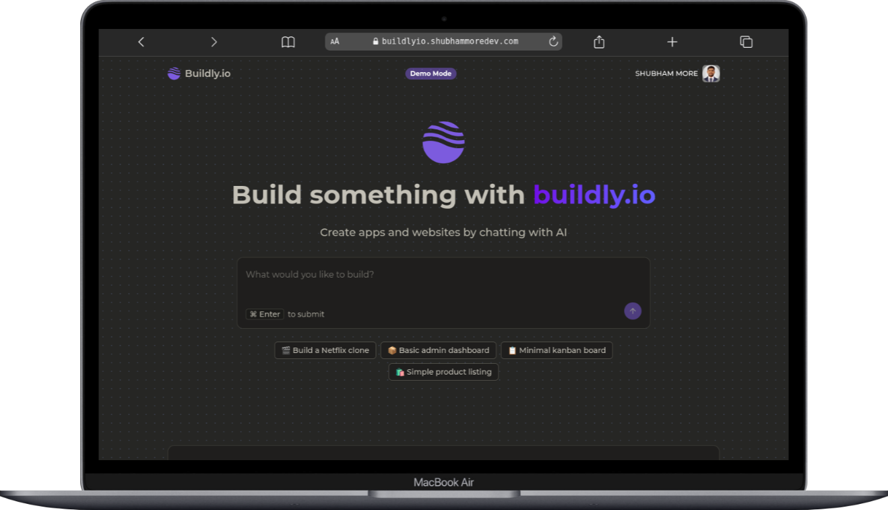

## Buildly.io



An experimental AI-driven website builder built to understand **how AI agents can be designed and orchestrated using JavaScript/TypeScript**, without relying on Python-based agent frameworks.

This project focuses on learning how a **Next.js application can directly interact with LLMs** and background agents to generate, execute, and preview code.

- ***LIVE URL:*** https://buildlyio.shubhammoredev.com

---

## 🧠 Project Intent

Buildly.io is **not** intended to compete with production-grade tools like Lovable or V0.

The goal of this project is to:
- Explore AI agent workflows using **Inngest**
- Understand how **LLMs (OpenAI)** can be connected to a modern web stack
- Learn how to safely **execute generated code** using sandbox environments
- Build an end-to-end AI workflow using **only JavaScript / TypeScript**

---

## ✨ Features

- Prompt-based frontend code generation
- Background agent orchestration using Inngest
- Secure sandboxed execution using E2B
- Live preview of generated code
- Iterative prompt → generate → preview workflow
- Clean, modern UI for experimentation

---

## 🛠 Tech Stack

### Frontend
- Next.js 15
- Tailwind CSS
- shadcn/ui

### Backend / Agents
- Next.js API routes
- Inngest (agent workflows & background jobs)
- OpenAI (LLM-based code generation)

### Tools / Infra
- E2B Sandbox (secure code execution)
- Prisma
- Inngest
- TRPC
- TANSTACK
- PostgreSQL
- Clerk (authentication)
- Vercel / VPS deployment

---

## 📦 Requirements

The following API keys are required to run the project:

- **OpenAI API Key** – used for generating frontend code via LLMs
- **E2B Sandbox API Key** – used for running generated code securely in isolated environments

---

## Environment Varirables (.env)
-  **OpenAI:** Used by the agent for code generation
```
OPENAI_API_KEY=sk-xxxx
```

- **E2B Sandbox**: Used for executing generated code in isolated sandboxes
```
E2B_SANDBOX_API_KEY=e2b_xxxx
```

- **Inngest**: Used for triggering and securing agent workflows in production
```
INNGEST_EVENT_KEY=xxxx
INNGEST_SIGNING_KEY=xxxx
```

- **Database**: Prisma database connection
```
DATABASE_URL=postgresql://...
```

- ***Authentication (Clerk)**: For User authentication
```
NEXT_PUBLIC_CLERK_PUBLISHABLE_KEY=pk_xxxx
CLERK_SECRET_KEY=sk_xxxx

NEXT_PUBLIC_CLERK_SIGN_IN_URL="/sign-in"
NEXT_PUBLIC_CLERK_SIGN_UP_URL="/sign-up"
NEXT_PUBLIC_CLERK_SIGN_IN_FALLBACK_REDIRECT_URL="/"
NEXT_PUBLIC_CLERK_SIGN_UP_FALLBACK_REDIRECT_URL="/"

```

- ***Security***: 
```
CRYPTO_SECRET_KEY="" # Used for encryption / hashing
ADMIN_SECRET="" # Used for admin-only access
```


## ▶️ Run Locally

```bash
git clone https://github.com/your-username/buildly.io

cd buildly.io

npm install

# generate prisma client
npx prisma generate

# (optional) run migrations
npx prisma migrate dev

# start inngest local server
npx inngest-cli@latest dev

# start next.js app
npm run dev
```

---

## ⚙️ Working Mechanism

```text
User Prompt
   ↓
Next.js App
   ↓
Inngest Agent (orchestration)
   ↓
OpenAI (code generation)
   ↓
E2B Sandbox (execute code)
   ↓
Live Preview URL